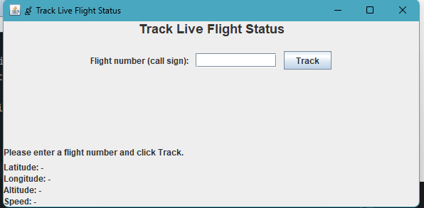

# Team Project

# GlobalFlight APP

# 📌 1. Overview

GlobalFlightApp is a Java application built using Clean Architecture and Swing that allows users to interact with real-time flight information.
The system integrates with the OpenSky Network API to fetch live aircraft data and provides multiple aviation-related features.

It is a flight tracking and information platform that allows users to quickly search for
real-time flight details (e.g. departure and arrival times), find available flights, and view the active flights of a specific airline.


# 👨‍💻 2. Team Members

- Zhaotong Pan
- Frank Li
- David Yao
- Yanfei Tu
- Alex Zhang

# 👥 3. User Stories & Responsibilities

| User Story | Description                                                                                                                                                            | Use Case #       | Assigned To      |
| ---------- |------------------------------------------------------------------------------------------------------------------------------------------------------------------------|------------------|------------------|
| **US1**    | As a user, I want to search for flight details using a flight number, so I can view basic details such as Call Sign, Origin Country, Time Position, Squawk, On Ground. | Use Case 1 (MVP) | **Frank Li**     |
| **US2**    | As a user, I want to add a flight to My Favourites, so I can quicklt check my preferred flights.                                                                       | Use Case 2 (MVP) | **Alex Zhang**   |
| **US3**    | As a user, I want to check ticket prices for a flight using its flight number, so that I can compare and plan my budget.                                               | Use Case 3       | *(optional)*     |
| **US4**    | As a user, I want to input departure and destination airports to check if there are available flights, so that I can choose a suitable flight plan.                    | Use Case 4 (MVP) | **Yanfei Tu**    |
| **US5**    | As a user, I want to view active flights operated by a specific airline (based on ICAO prefix), so that I can see its current operations.                              | Use Case 5 (MVP) | **Zhaotong Pan** |
| **US6**    | As a user, I want to track the live status of a flight in real time, so that I can see whether it’s on time, delayed, or already landed.                               | Use Case 6 (MVP) | **David Yao**    |


Our MVP includes Use Cases: 1, 2, 4, 5, 6


# 🌐 4. API Information
Primary API: OpenSky Network API

https://openskynetwork.github.io/opensky-api/

Authentication


🔐 OAuth2 Client Credentials Flow

OpenSky deprecated username/password authentication for new users.
Our project uses the OAuth2 Client Credentials Flow, which is the recommended, secure, and modern approach.


We send a POST request to the OpenSky authentication server
with client credentials, our client id and our client secret. If successful, the server returns a JSON object containing
the access token. Then we use tokens for API request.

This gives us:
- Higher request limits (4000/day)
- More stable API access
- No 429 (Too Many Requests) issues


# 🏗️ 5. Architecture

The project uses Clean Architecture:

Entities

- Flight
- AirlineFlight
- Favourite
- FlightStatus

Use Cases

- Input Data
- Output Data
- Use Case Interactor
- Input Boundary
- Output Boundary
- Data Access Interface

Interface Adapters

- Controller
- Presenter
- View Model

Frameworks / Drivers

- View
- Data Access


# 🖥️ 5. Functionality

# 🏠 Main Menu


Includes buttons for MVP use cases, exit button and a centered image.

# 🛫 Use Case 1: Search Flight Details

Use Case 1 allows for a user to input the ICAO prefix of a flight in addition to number assigned, flight number,
the user will be returned with the flight, Call Sign, Origin Country, Time Position, Squawk, On Ground.
The system then filters the data provided by the OpenSky API for the above mentioned information.

Invalid flight numbers will be defined as flight numbers that are not currently being used by aircraft preparing for operations,
and during operations.

More specifically, if a flight ACA007 is scheduled to fly at 0700HRS Zulu, but at the time of searching, it is 0600HRZS Zulu,
the flight number will be invalid, as the aircraft is not currently transmitting the callsign information thus OpenSky is not able
to retreive the information regarding the flight.

| Case                                 | Meaning                                             | Expected message              |
|--------------------------------------|-----------------------------------------------------|-------------------------------|
| **Invalid ICAO call sign**           | ICAO CallSign incorrect.                            | `"Unknown/Not ACTIVE Flight"` |
| **Valid ICAO prefix but not flying** | CallSign, exists but no aircraft airborne right now | `"Time Position: -1"`         |
| **Valid prefix with active flights** | Airline exists + OpenSky returned matches           | Display all valid information |

The system ONLY provides flights that are on the OpenSky API; this meaning, if a flight is displayed on other flight
tracking websites such as flightradar24 and not on OpenSky, the search function will display that the inputted callsign
flight's Origin Country is "Unknown/Not ACTIVE Flight", and Time Position as -1.

This use case is not restricted, however, Squawk Code is sometimes displayed as "Unknown" and not to be taken as the flight
is invalid / incorrect input. The squawk being unknown is simply a matter of on some flights it is not public information,
and changes frequently based on air traffic control reasons.

# Main Flow:

The user enters a valid flight number, such as ACA007, the system will display the following information.
As ACA007 is an AirCanada flight originating from YVR, Vancouver International Airport, to HKG Hongkong International Airport
the information will be as follows:


-Callsign: ACA007

-Origin Country: Canada

-Time Position: 1764280572

-Squawk: Unknown

-On Ground: False

# Alternative Flow:
If the user enters a invalid flight number, such as ACA207322 the system will display the following infromation.

-Callsign: ACA007

-Origin Country: Unknown/Not ACTIVE Flight

-Time Position: -1

-Squawk: Unknown

-On Ground: True

# 🛫 Use Case 2: Favourite a Flight

Use Case 2 allows a user to save their preferred flights to a favourites list for quick access.

The user enters a flight number (such as AC123 for Air Canada or UA456 for United Airlines), and the system validates the input and stores it in an in-memory favourites list.

The system checks if the flight number is not empty and ensures it hasn't already been added to favourites.

This feature provides users with a way to track flights they're interested in without having to search for them repeatedly, making it easier to monitor flights of personal interest.


The system: 

| Case                          | Meaning                                            | Expected message               |
| ----------------------------- | -------------------------------------------------- |--------------------------------|
| **Valid flight number**       | Flight number is not empty and not yet favourited     | Success message (green)           |
| **Duplicate flight number** | Flight number already exists in favourites | Error message (red) |
| **Invalid input** | Flight number is empty, null, or whitespace          | Error message (red)       |

To support this behavior, the FavouriteFlightInteractor validates that input is not empty and uses the Favourite entity's equals() and hashCode() methods to prevent duplicate entries.

The favourites storage is implemented as a static HashSet in the FavouriteFlightInteractor class.

This approach provides fast duplicate checking and persistence during the application runtime.

The system does not validate the flight number format itself - any non-empty string is accepted as a valid flight number.
This design choice is sufficient for the intended use case, because:

1. The feature is designed for users to track any flights they're interested in, regardless of format.
2. No external API call is made to verify if the flight actually exists.
3. Format validation could be added later without changing the architecture if needed.

Although favourites are lost when the application closes, this implementation is suitable for the current requirements.

# Main Flow:

The user enters a valid input, e.g. AC123 for Air Canada, in the "Flight Number:" text field.

The user clicks the "❤️ Add to Favourites" button.

The system displays a success message in the "Status / Favourites List" area (shown in green):

✓ SUCCESS! 

Flight AC123 has been added to your favourites.


Additionally, users can click "📋 View All Favourites" button to see a numbered list of all favourited flights with the total count displayed in the bottom result area.


# Alternative Flow:

If the user enters an invalid input (empty, null, or whitespace only) or a flight number that is already in favourites, and tries to add it. 

Then the system will display an error message in the "Status / Favourites List" area (shown in red):

✗ ERROR

Flight number is invalid or already in favourites.
Please check and try again.


Enters an invalid input (empty, null, or whitespace only)


Enters a flight number that is already in favourites


# 🛫 Use Case 5: View Active Flights

Use Case 5 allows a user to view currently active flights belonging to a specific airline.
The user enters an airline ICAO prefix (such as ACA for Air Canada or AAL for American Airlines), and the system retrieves real-time aircraft data from the OpenSky Network API.

The system then filters all live aircraft by callsign prefix and displays matching flights of the given airline, along with other important information, including each aircraft’s registered country, live location (latitude and longitude), altitude, speed and the last update time.
This feature provides users with a quick snapshot of the aircraft currently operating under a chosen airline.

OpenSky’s /states/all endpoint returns real-time ADS-B state vectors for aircraft currently broadcasting.
However, it does not include every ICAO airline code in the world — only airlines that currently have transponders visible to the network.

And our system must distinguish between:

| Case                                        | Meaning                                            | Expected message               |
| ------------------------------------------- | -------------------------------------------------- |--------------------------------|
| **Invalid ICAO prefix**                     | Prefix not used by any real airline in OpenSky     | `"Invalid input..."`           |
| **Valid ICAO prefix but no active flights** | Airline exists, but no aircraft airborne right now | `"No active flights found..."` |
| **Valid prefix with active flights**        | Airline exists + OpenSky returned matches          | Display a list of flights      |

To support this behavior, we built a validated ICAO airline prefix set (In ViewActiveFlightsInteractor) based on real-world prefixes that actively appear in OpenSky’s ADS-B stream.

The ICAO prefix set included in this project does not contain every airline code in the world.
Instead, it contains a curated collection of major and frequently active airlines that reliably appear in the OpenSky ADS-B live feed.

This includes most famous international carriers such as:
- ✈️ American Airlines (AAL)
- ✈️ Delta (DAL)
- ✈️ United (UAL)
- ✈️ Air Canada (ACA)
- ✈️ WestJet (WJA)
- ✈️ British Airways (BAW)
- ✈️ Emirates (UAE)
- ✈️ Japan Airlines (JAL)
- and many others…

Although not complete, the set is sufficient for the intended use case, because:
1. Most users search for well-known airlines, which are included.
2. Many smaller or regional airlines do not consistently appear in OpenSky's live ADS-B data due to limited coverage or 
infrequent operations. Even with authenticated API access, including these airlines would not improve functionality, 
so the project uses the set of major airline ICAO prefixes that reliably have active flights.

The chosen list provides excellent coverage while ensuring a clear and reliable user experience.

# Main Flow:
The user enters a valid input, e.g. ACA represents for Air Canada.

Displays some active flights of the given airline along with some important information
- Callsign (the real-time identifier broadcast by an aircraft (e.g. ACA551 represents for Air Canada flight 551))
- Registered country
- Location (Latitude and Longitude)
- Altitude
- Speed
- Last update time


# Alternative Flow 1 :
If the user enters a valid input, but there is no active flight for this airline.

For example AUR (the prefix of Aurigny Air Services) is a valid input and there is no active flight for this airline, then the system will display that no active flights found for this airline.


# Alternative Flow 2 :
If the user enters an invalid input, the system will display that this is an invalid input, as the picture shows:


# 🛫 Use Case 6: Track Flight Status


## User Story

> As a traveller, I want to enter a flight number and see its live position and speed,  
> so that I can quickly check the current status of my flight.

This use case lets the user type a flight number (call sign, e.g. `AC123`),  
fetch live data from the OpenSky API, and display:

- Latitude / Longitude (degrees)
- Altitude (meters)
- Speed (m/s)
- Last update time (converted from Unix seconds to local time)

---

## Flow of Control

1. In **`MainMenu`**, the user clicks **“Track Live Flight Status”**.  
   `AppBuilder` constructs the objects for this feature and shows `TrackFlightStatusView`.

2. In `TrackFlightStatusView`, the user enters a flight number and clicks **Track**.  
   The view calls:
   ```java
   controller.track(flightNumber);
   
3. `TrackFlightStatusController` wraps the string in TrackFlightStatusInputData and calls:
    ```java
    interactor.execute(inputData);

4. `TrackFlightStatusInteractor`:
    - Validates the input 
    - Uses `TrackFlightStatusDataAccessInterface` to fetch a FlightStatus from OpenSky 
    - Converts lastUpdate (Unix seconds) to a local time string 
    - Builds TrackFlightStatusOutputData and calls presenter.present(outputData).

5. `TrackFlightStatusPresenter` copies fields from `OutputData` into `TrackFlightStatusViewModel`
(flightNumber, latitude, longitude, altitude, speed, message, etc.).

6. `TrackFlightStatusView` calls `refreshFromViewModel()`, reads the ViewModel, and updates the labels
(summary message + latitude / longitude / altitude / speed shown to the user).
---

Please keep this up-to-date with information about your project throughout the term.

The readme should include information such as:
- a summary of what your application is all about
- a list of the user stories, along with who is responsible for each one
- information about the API(s) that your project uses 
- screenshots or animations demonstrating current functionality

By keeping this README up-to-date,
your team will find it easier to prepare for the final presentation
at the end of the term.

