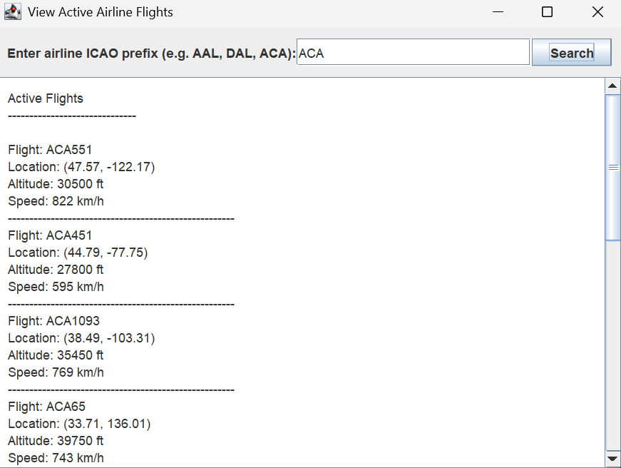

# Team Project

# GlobalFlight APP

# 📌 1. Overview

GlobalFlightApp is a Java application built using Clean Architecture and Swing that allows users to interact with real-time flight information.
The system integrates with the OpenSky Network API to fetch live aircraft data and provides multiple aviation-related features.

It is a flight tracking and information platform that allows users to quickly search for
real-time flight details (e.g. departure and arrival times), find available flights, and view the active flights of a specific airline.

# 👨‍💻 2. Team Members

- Zhaotong Pan
- Frank Li
- David Yao
- Yanfei Tu
- Alex Zhang

# 👥 3. User Stories & Responsibilities

| User Story | Description                                                                                                                                         | Use Case #       | Assigned To |
| ---------- |-----------------------------------------------------------------------------------------------------------------------------------------------------|------------------|-|
| **US1**    | As a user, I want to search for flight details using a flight number, so I can view basic details such as departure and arrival times.              | Use Case 1 (MVP) | **Frank Li** |
| **US2**    | As a user, I want to add a flight to My Favourites, so I can quicklt check my preferred flights.                                                    | Use Case 2 (MVP) | **Alex Zhang** |
| **US3**    | As a user, I want to check ticket prices for a flight using its flight number, so that I can compare and plan my budget.                            | Use Case 3       | *(optional)* |
| **US4**    | As a user, I want to input departure and destination airports to check if there are available flights, so that I can choose a suitable flight plan. | Use Case 4 (MVP) | |
| **US5**    | As a user, I want to view active flights operated by a specific airline (based on ICAO prefix), so that I can see its current operations.           | Use Case 5 (MVP) | **Zhaotong Pan** |
| **US6**    | As a user, I want to track the live status of a flight in real time, so that I can see whether it’s on time, delayed, or already landed.            | Use Case 6 (MVP) | |

Our MVP includes Use Cases: 1, 2, 4, 5, 6

# 🌐 4. API Information
Primary API: OpenSky Network API

https://opensky-network.org/api

Endpoints used GET /states/all

Returns all live aircraft state vectors in the world:

- callsign

- latitude & longitude

- speed

- geometric altitude

Authentication

🔐 OAuth2 Client Credentials Flow

OpenSky now requires OAuth2 for all accounts created after March 2025.

Our system:

Requests a token using
POST https://auth.opensky-network.org/auth/realms/opensky-network/protocol/openid-connect/token

Uses the token in the header
Authorization: Bearer <token>

Refreshes the token automatically when expired

This gives us:

Higher request limits (4000/day)

More stable API access

No more 429 (Too Many Requests) issues

# 🏗️ 5. Architecture

The project uses Clean Architecture:

Entities

- Flight
- AirlineFlight
- Favourite
- FlightStatus

Use Cases

- Input Data
- Output Data
- Use Case Interactor
- Input Boundary
- Output Boundary
- Data Access Interface

Interface Adapters

- Controllers
- Presenters

Frameworks / Drivers

- View
- Data Access

# 🖥️ 5. Screenshots for functionality

# 🏠 Main Menu

Includes buttons for MVP use cases, exit button and a centered image.

# 🛫 Use Case 5: View Active Flights

Displays some active flights of the given airline and basic information
- Callsign (the real-time identifier broadcast by an aircraft (e.g. ACA551 represents for Air Canada flight 551))
- Latitude/Longitude
- Altitude (converted to feet)
- Speed (km/h)

Please keep this up-to-date with information about your project throughout the term.

The readme should include information such as:
- a summary of what your application is all about
- a list of the user stories, along with who is responsible for each one
- information about the API(s) that your project uses 
- screenshots or animations demonstrating current functionality

By keeping this README up-to-date,
your team will find it easier to prepare for the final presentation
at the end of the term.

