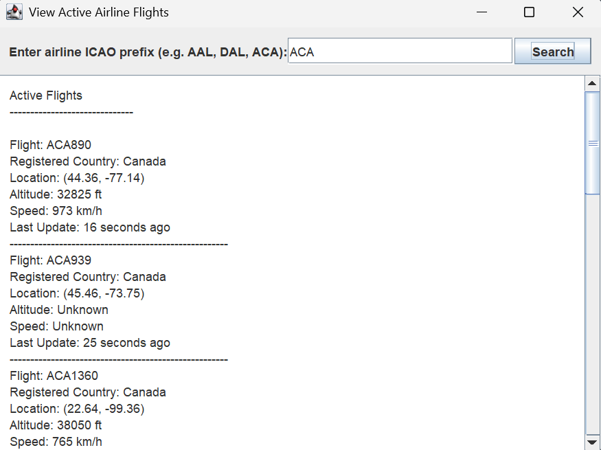
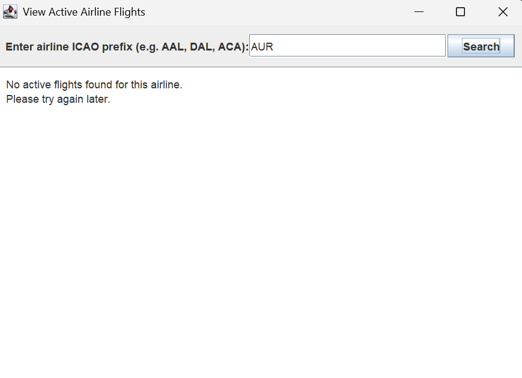
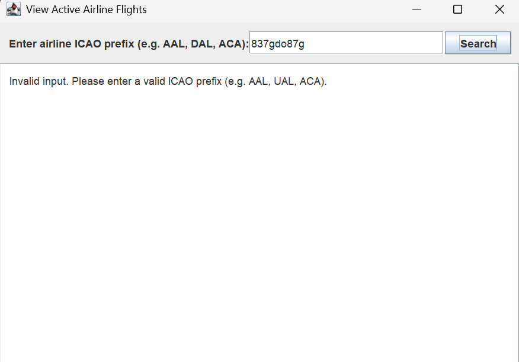

# Team Project

# GlobalFlight APP

# 📌 1. Overview

GlobalFlightApp is a Java application built using Clean Architecture and Swing that allows users to interact with real-time flight information.
The system integrates with the OpenSky Network API to fetch live aircraft data and provides multiple aviation-related features.

It is a flight tracking and information platform that allows users to quickly search for
real-time flight details (e.g. departure and arrival times), find available flights, and view the active flights of a specific airline.

# 👨‍💻 2. Team Members

- Zhaotong Pan
- Frank Li
- David Yao
- Yanfei Tu
- Alex Zhang

# 👥 3. User Stories & Responsibilities

| User Story | Description                                                                                                                                                            | Use Case #       | Assigned To      |
| ---------- |------------------------------------------------------------------------------------------------------------------------------------------------------------------------|------------------|------------------|
| **US1**    | As a user, I want to search for flight details using a flight number, so I can view basic details such as Call Sign, Origin Country, Time Position, Squawk, On Ground. | Use Case 1 (MVP) | **Frank Li**     |
| **US2**    | As a user, I want to add a flight to My Favourites, so I can quicklt check my preferred flights.                                                                       | Use Case 2 (MVP) | **Alex Zhang**   |
| **US3**    | As a user, I want to check ticket prices for a flight using its flight number, so that I can compare and plan my budget.                                               | Use Case 3       | *(optional)*     |
| **US4**    | As a user, I want to input departure and destination airports to check if there are available flights, so that I can choose a suitable flight plan.                    | Use Case 4 (MVP) | **Yanfei Tu**    |
| **US5**    | As a user, I want to view active flights operated by a specific airline (based on ICAO prefix), so that I can see its current operations.                              | Use Case 5 (MVP) | **Zhaotong Pan** |
| **US6**    | As a user, I want to track the live status of a flight in real time, so that I can see whether it’s on time, delayed, or already landed.                               | Use Case 6 (MVP) | **David Yao**    |

Our MVP includes Use Cases: 1, 2, 4, 5, 6

# 🌐 4. API Information
Primary API: OpenSky Network API

https://openskynetwork.github.io/opensky-api/

Authentication

🔐 OAuth2 Client Credentials Flow

OpenSky deprecated username/password authentication for new users.
Our project uses the OAuth2 Client Credentials Flow, which is the recommended, secure, and modern approach.

We send a POST request to the OpenSky authentication server
with client credentials, our client id and our client secret. If successful, the server returns a JSON object containing
the access token. Then we use tokens for API request.

This gives us:
- Higher request limits (4000/day)
- More stable API access
- No 429 (Too Many Requests) issues

# 🏗️ 5. Architecture

The project uses Clean Architecture:

Entities

- Flight
- AirlineFlight
- Favourite
- FlightStatus

Use Cases

- Input Data
- Output Data
- Use Case Interactor
- Input Boundary
- Output Boundary
- Data Access Interface

Interface Adapters

- Controller
- Presenter
- View Model

Frameworks / Drivers

- View
- Data Access

# 🖥️ 5. Functionality

# 🏠 Main Menu

Includes buttons for MVP use cases, exit button and a centered image.

# 🛫 Use Case 1: Search Flight Details

Use Case 1 allows for a user to input the ICAO prefix of a flight in addition to number assigned, flight number,
the user will be returned with the flight, Call Sign, Origin Country, Time Position, Squawk, On Ground.
The system then filters the data provided by the OpenSky API for the above mentioned information.

| Case                                 | Meaning                                             | Expected message              |
|--------------------------------------|-----------------------------------------------------|-------------------------------|
| **Invalid ICAO call sign**           | ICAO CallSign incorrect.                            | `"Unknown/Not ACTIVE Flight"` |
| **Valid ICAO prefix but not flying** | CallSign, exists but no aircraft airborne right now | `"Time Position: -1"`         |
| **Valid prefix with active flights** | Airline exists + OpenSky returned matches           | Display all valid information |

The system ONLY provides flights that are on the OpenSky API; this meaning, if a flight is displayed on other flight
tracking websites such as flightradar24 and not on OpenSky, the search function will display that the inputted callsign
flight's Origin Country is "Unknown/Not ACTIVE Flight", and Time Position as -1.

This use case is not restricted, however, Squawk Code is sometimes displayed as "Unknown" and not to be taken as the flight
is invalid / incorrect input. The squawk being unknown is simply a matter of on some flights it is not public information,
and or it changes frequently due to airtraffic control reasons.

# 🛫 Use Case 5: View Active Flights

Use Case 5 allows a user to view currently active flights belonging to a specific airline.
The user enters an airline ICAO prefix (such as ACA for Air Canada or AAL for American Airlines), and the system retrieves real-time aircraft data from the OpenSky Network API.

The system then filters all live aircraft by callsign prefix and displays up to 10 matching flights, including each aircraft’s registered country, live location (latitude and longitude), altitude, speed and the last update time.
This feature provides users with a quick snapshot of the aircraft currently operating under a chosen airline.

OpenSky’s /states/all endpoint returns real-time ADS-B state vectors for aircraft currently broadcasting.
However, it does not include every ICAO airline code in the world — only airlines that currently have transponders visible to the network.

And our system must distinguish between:

| Case                                        | Meaning                                            | Expected message               |
| ------------------------------------------- | -------------------------------------------------- |--------------------------------|
| **Invalid ICAO prefix**                     | Prefix not used by any real airline in OpenSky     | `"Invalid input..."`           |
| **Valid ICAO prefix but no active flights** | Airline exists, but no aircraft airborne right now | `"No active flights found..."` |
| **Valid prefix with active flights**        | Airline exists + OpenSky returned matches          | Display a list of flights      |

To support this behavior, we built a validated ICAO airline prefix set (In ViewActiveFlightsInteractor) based on real-world prefixes that actively appear in OpenSky’s ADS-B stream.

The ICAO prefix set included in this project does not contain every airline code in the world.
Instead, it contains a curated collection of major and frequently active airlines that reliably appear in the OpenSky ADS-B live feed.

This includes most famous international carriers such as:
- ✈️ American Airlines (AAL)
- ✈️ Delta (DAL)
- ✈️ United (UAL)
- ✈️ Air Canada (ACA)
- ✈️ WestJet (WJA)
- ✈️ British Airways (BAW)
- ✈️ Emirates (UAE)
- ✈️ Japan Airlines (JAL)
- and many others…

Although not complete, the set is sufficient for the intended use case, because:
1. Most users search for well-known airlines, which are included.
2. Many smaller or regional airlines do not consistently appear in OpenSky's live ADS-B data due to limited coverage or 
infrequent operations. Even with authenticated API access, including these airlines would not improve functionality, 
so the project uses the set of major airline ICAO prefixes that reliably have active flights.

The chosen list provides excellent coverage while ensuring a clear and reliable user experience.

# Main Flow:
The user enters a valid input, e.g. ACA represents for Air Canada.

Displays some active flights of the given airline along with some important information
- Callsign (the real-time identifier broadcast by an aircraft (e.g. ACA551 represents for Air Canada flight 551))
- Registered country
- Location (Latitude and Longitude)
- Altitude
- Speed
- Last update time

# Alternative Flow 1 :
If the user enters a valid input, but there is no active flight for this airline.

For example AUR (the prefix of Aurigny Air Services) is a valid input and there is no active flight for this airline, then the system will display that no active flights found for this airline.

# Alternative Flow 2 :
If the user enters an invalid input, the system will display that this is an invalid input, as the picture shows:

Please keep this up-to-date with information about your project throughout the term.

The readme should include information such as:
- a summary of what your application is all about
- a list of the user stories, along with who is responsible for each one
- information about the API(s) that your project uses 
- screenshots or animations demonstrating current functionality

By keeping this README up-to-date,
your team will find it easier to prepare for the final presentation
at the end of the term.

